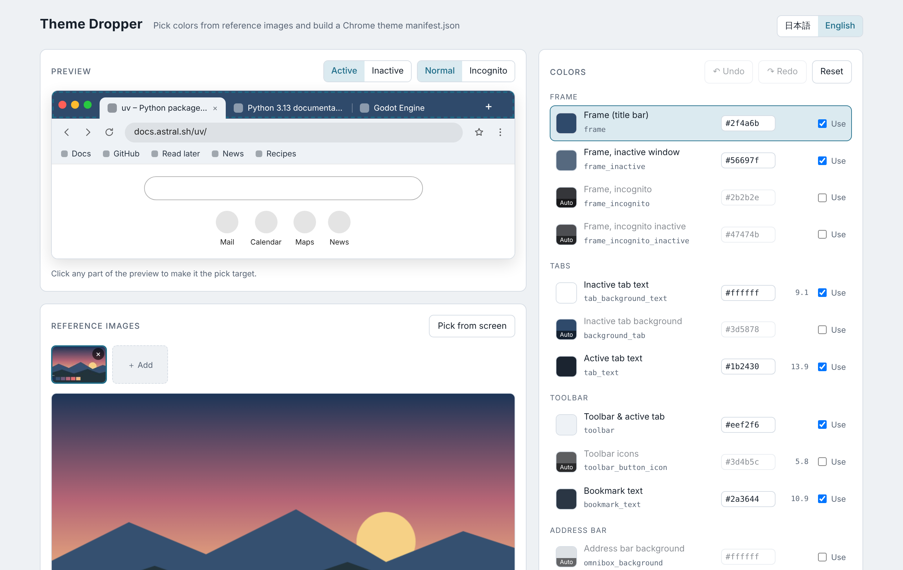

# Theme Dropper

> 日本語の説明は[下にあります](#日本語)。 / Japanese follows the English section.

Pick colors from reference images and build a Chrome theme `manifest.json` — no install, just one HTML page.

## What it does

- **Pick colors from images** — load as many reference images as you like (drag & drop, paste with ⌘V / Ctrl+V, or the Add button). Hover to get a magnifier loupe, click to pick.
- **Pick from anywhere on screen** — the "Pick from screen" button uses Chrome's EyeDropper API.
- **Live preview** — a mock Chrome window shows the title bar, tabs, toolbar, address bar, bookmarks bar and New Tab page. Click any part of the preview to make it the pick target. Switch between active / inactive and normal / incognito.
- **Contrast check** — text colors show their contrast ratio against the background they sit on; values under 3 are flagged.
- **Undo / redo** — ⌘Z / ⇧⌘Z (Ctrl+Z / Ctrl+Shift+Z).
- **Export** — download `manifest.json`, copy it, or write it straight into a folder (File System Access API). After the first export to a folder, later exports overwrite the same file.
- **Re-edit** — load an existing theme `manifest.json` to keep working on it.

Colors you leave unchecked ("Use") are left out of the manifest, so Chrome picks them automatically.

The UI is available in English and Japanese. It follows your browser's language on first open, and the 日本語 / English switch in the top-right corner remembers your choice.

## Usage

1. Open the page in Chrome: **https://bravotan.github.io/theme-dropper/** (or download `index.html` and open it locally).
2. Pick your colors, then export `manifest.json` into a folder of its own, e.g. `~/ChromeThemes/my-theme`.
3. Open `chrome://extensions`, turn on **Developer mode**, click **Load unpacked**, and choose that folder.
4. To update the theme, export again to the same folder and press the reload (↻) button on the theme's card.

To go back to the default look: `chrome://settings/appearance` → **Theme** → **Reset to default**.

## Browser support

Built for desktop Chrome (and other Chromium browsers). Folder export and screen picking depend on Chromium-only APIs; on other browsers those buttons are hidden and you can still download or copy the manifest.

The page must be opened as a normal tab. Inside an iframe or a sandboxed embed, downloads, folder export and the eyedropper may be blocked.

## Privacy

Everything runs in your browser. Images are never uploaded anywhere. Your colors are saved to `localStorage` so they survive a reload.

## License

[MIT](LICENSE)

---

# Theme Dropper(日本語)

参考画像から色を拾って、Chromeテーマの `manifest.json` を作るツールです。インストール不要、HTML 1枚で動きます。

## できること

- **画像から色を拾う**:参考画像を何枚でも読み込めます(ドラッグ&ドロップ、⌘V で貼り付け、「追加」ボタン)。カーソルを乗せるとルーペが出て、クリックで色を取得します。
- **画面のどこからでも拾う**:「画面から拾う」ボタンで、ChromeのEyeDropper APIを使って画面上の任意の色を取得できます。
- **プレビュー**:Chromeウィンドウ風のプレビューで、タイトルバー・タブ・ツールバー・アドレスバー・ブックマークバー・新しいタブの見た目を確認できます。プレビューの部分をクリックすると、そこがピック先になります。アクティブ/非アクティブ、通常/シークレットの切り替えにも対応しています。
- **コントラスト確認**:文字色には背景とのコントラスト比を表示します。3未満は警告色になります。
- **元に戻す/やり直す**:⌘Z / ⇧⌘Z。
- **書き出し**:manifest.json のダウンロード、コピー、フォルダへの直接書き出し(File System Access API)。一度フォルダを選ぶと、以降は同じファイルへの上書きになります。
- **再編集**:既存のテーマの manifest.json を読み込んで続きから編集できます。

「使う」のチェックを外した色は manifest に含めず、Chromeの自動配色に任せます。

UIは日本語と英語に対応しています。最初はブラウザの言語設定に合わせて表示され、右上の「日本語 / English」で切り替えると、その選択を記憶します。

## 使い方

1. Chromeで **https://bravotan.github.io/theme-dropper/** を開きます(`index.html` をダウンロードしてローカルで開いてもOK)。
2. 色を決めたら、テーマ専用のフォルダ(例:`~/ChromeThemes/my-theme`)に manifest.json を書き出します。
3. `chrome://extensions` を開き、「デベロッパーモード」をオンにして、「パッケージ化されていない拡張機能を読み込む」でそのフォルダを選びます。
4. 色を変えたら同じフォルダに書き出し直し、拡張機能カードの更新ボタン(↻)を押します。

元の見た目に戻すには、`chrome://settings/appearance` →「テーマ」→「デフォルトにリセット」。

## 対応ブラウザ

デスクトップ版のChrome(およびChromium系ブラウザ)向けです。フォルダへの書き出しと画面からのピックはChromium独自のAPIを使っているため、他のブラウザではボタンが表示されません。その場合もダウンロードとコピーは使えます。

ページは通常のタブで開いてください。iframeやサンドボックスの中では、ダウンロード・フォルダ書き出し・スポイトが動かないことがあります。

## プライバシー

すべてブラウザ内で処理します。画像がどこかへアップロードされることはありません。色の設定は再読み込みしても残るよう `localStorage` に保存します。

## ライセンス

[MIT](LICENSE)
